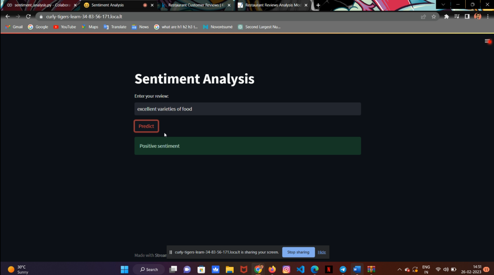
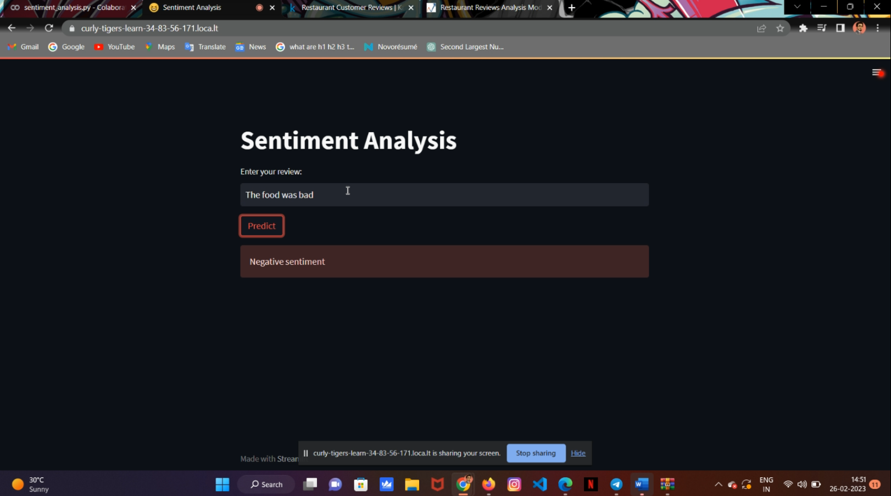

```markdown
# 🌟 Sentiment Analysis Using Machine Learning 🧐🍽️

We’re using **machine learning** to predict whether a restaurant review is **positive** or **negative**! Let’s dive into it step-by-step. 🚀

## 📊 Step 1: Loading the Data
We use restaurant reviews from a `.tsv` file that includes labels (`1` for 👍 positive and `0` for 👎 negative).

```python
data = pd.read_csv("Restaurant_Reviews.tsv", sep='\t')
```

## 🔍 Step 2: Exploratory Data Analysis
Let’s see how many reviews are positive vs negative. We visualize this using a **bar chart**! 📊

```python
sns.barplot(x=data['Liked'].value_counts().index, y=data['Liked'].value_counts().values)
```

## 🛠️ Step 3: Preprocessing the Text
We convert the text reviews into numerical data (machine-readable!) using `CountVectorizer` 🧮.

```python
vectorizer = CountVectorizer()
X = vectorizer.fit_transform(data['Review']).toarray()
```

## 🔄 Step 4: Splitting the Data
We split the data into training and testing sets to evaluate our models. 🎓✂️

```python
X_train, X_test, y_train, y_test = train_test_split(X, y, test_size=0.2, random_state=0)
```

## 🧠 Step 5: Training the Models
We’re using **two models**:
- 🧮 **Naive Bayes** for fast results.
- 🚀 **Support Vector Machine (SVM)** for precise predictions.

```python
# Train Naive Bayes
nb_model.fit(X_train, y_train)

# Train SVM
svm_model.fit(X_train, y_train)
```

## ⚖️ Step 6: Testing the Models
We use the **accuracy score** to measure how well our models performed. 🎯

```python
nb_accuracy = accuracy_score(y_test, nb_model.predict(X_test))
svm_accuracy = accuracy_score(y_test, svm_model.predict(X_test))
```

## 💾 Step 7: Saving and Reusing the Model
Save the trained model so we can reuse it anytime! 🛠️💾

```python
joblib.dump(svm_pipeline, 'svm_pipeline.joblib')
```

## 🖥️ Step 8: Web App Using Streamlit
Finally, we built a cool **Streamlit app** that lets you input your review and get an instant sentiment analysis result! 🎉😎

```python
import streamlit as st

# Load the model
model = joblib.load('svm_pipeline.joblib')

# Create the app
def app():
    st.title('🍽️ Restaurant Review Sentiment Analyzer')
    review = st.text_input('Enter your review:')
    if st.button('Analyze'):
        sentiment = model.predict([review])[0]
        if sentiment == 1:
            st.success('🎉 Positive Sentiment!')
        else:
            st.error('🙁 Negative Sentiment')
app()
```

## 📸 Screenshots:
Here are a few screenshots from the **Streamlit app** that we built to predict sentiment:

### Positive review:


### Negative review:



---

## 🎉 Conclusion:
With a few lines of code and some powerful machine learning tools, we created a **sentiment analysis** system that can predict whether a restaurant review is positive or negative, and even built a **web app** for easy use! 🚀🍽️


